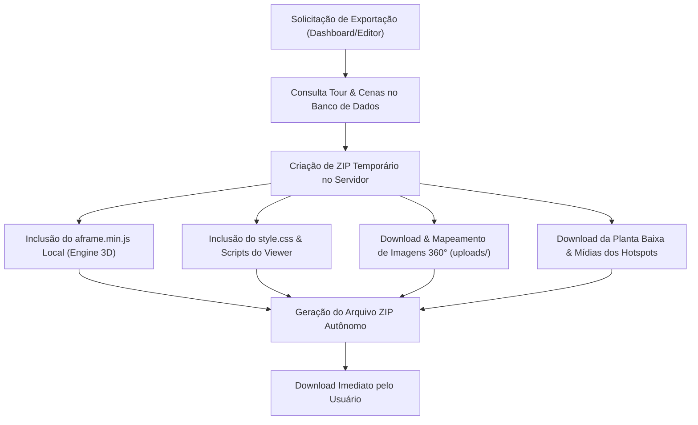

# 📦 Tutorial Exclusivo: Como Funciona o Tour Offline (Acesso Local) no 360° Studio

Bem-vindo ao tutorial oficial do recurso **Tour Offline (Acesso Local)** do **360° Studio**. Este guia detalha o funcionamento técnico, a estrutura do pacote e como executar passeios virtuais 360° sem depender de qualquer conexão com a internet ou servidor remoto.

---

## 🎯 O que é o Tour Offline?

O recurso de **Tour Offline** permite exportar qualquer projeto de passeio virtual 360° criado no editor em um arquivo único **ZIP estático e autônomo**. 

Ao descompactar este arquivo, a experiência interativa funciona inteiramente no dispositivo do usuário (notebook, computador, tablet ou tótem), garantindo:
- **Zero Latência:** Carregamento ultra-rápido de cenas em 4K/8K direto do disco local.
- **Independência de Conexão:** Ideal para estandes de vendas em feiras imobiliárias, apresentações corporativas presenciais, reuniões em locais sem sinal de Wi-Fi ou áreas rurais.
- **Entregável Premium:** Possibilidade de entregar o pacote ZIP em um pendrive personalizado para o cliente final.

---

## ⚙️ Como Funciona o Empacotamento Técnico (`export_tour.php`)

Quando o usuário solicita a exportação de um tour no painel de controle (disponível nos planos **Pessoal** e **Profissional**), o motor do backend ([api/export_tour.php](file:///g:/Meu%20Drive/Dev's/360/360/api/export_tour.php)) realiza as seguintes etapas automáticas:



### 📁 Estrutura do Pacote ZIP Gerado

Ao descompactar o arquivo ZIP baixado (`tour_[ID].zip`), a seguinte estrutura de arquivos é criada:

```text
meu_tour_offline/
├── index.html               # Aplicação principal (Viewer autônomo com JSON da cena embutido)
├── aframe.min.js            # Engine 3D WebGL (A-Frame 1.4.2)
├── style.css                # Estilos visuais e responsivos da interface
└── assets/                  # Pasta contendo todas as mídias locais
    ├── cena_1.jpg           # Imagem equiretangular 360°
    ├── cena_2.jpg           # Imagem equiretangular 360°
    ├── plantabaixa.png      # Planta baixa interativa (se houver)
    ├── logo_cliente.png     # Logotipo personalizado do cliente (se houver)
    └── audio_ambiente.mp3   # Áudio de fundo (se houver)
```

---

## 🚀 Como Executar o Tour Offline (Passo a Passo)

### Método 1: Execução Direta no Navegador (Simples)

1. **Baixe e extraia** o arquivo ZIP para uma pasta no computador (ex: `C:\MeusTours\TourResidencial\`).
2. Abra a pasta e dê um **duplo clique no arquivo `index.html`**.
3. O navegador padrão (Google Chrome, Microsoft Edge, Mozilla Firefox ou Safari) abrirá o passeio virtual instantaneamente.

> [!NOTE]
> Em algumas versões estritas de navegadores, restrições locais de segurança (CORS para o protocolo `file://`) podem limitar o áudio ou recursos avançados. Para apresentações profissionais, recomendamos o Método 2 ou 3.

---

### Método 2: Servidor Local HTTP Leve (Recomendado para Apresentações)

Para garantir 100% de suporte a todos os navegadores sem restrições de segurança do protocolo `file://`:

#### Opção A: Extensão "Live Server" ou "Web Server for Chrome"
- Abra a pasta do tour extraído na extensão e clique em **Start Server**.
- O tour abrirá no endereço local `http://127.0.0.1:8887`.

#### Opção B: Terminal com Python (Windows / Mac / Linux)
Abra o Prompt de Comando (CMD) ou Terminal na pasta do tour extraído e execute:
```bash
python -m http.server 8080
```
Em seguida, abra o navegador no endereço: `http://localhost:8080`

---

### Método 3: Modo Tótem Interativo / Kiosk (Feiras e Estandes)

Para criar uma experiência imersiva em tótens touch de feiras e estandes de vendas sem barras de navegação do Windows/Navegador:

1. Crie um atalho do **Google Chrome** ou **Edge**.
2. Clique com o botão direito no atalho > **Propriedades**.
3. No campo **Destino**, adicione a flag `--kiosk` apontando para o arquivo local:
   ```text
   "C:\Program Files\Google\Chrome\Application\chrome.exe" --kiosk "C:\MeusTours\TourResidencial\index.html"
   ```
4. Ao abrir o atalho, o passeio virtual ocupará 100% da tela em modo imersivo travado para o visitante.

---

## 🔒 Matriz de Liberdade e Licenciamento do Tour Offline

| Recursos Incluídos no Pacote Offline | Plano Grátis | Iniciante | Básico | Pessoal | Profissional |
| :--- | :---: | :---: | :---: | :---: | :---: |
| **Exportação ZIP Autônoma** | ❌ | ❌ | ❌ | ✅ | ✅ |
| **Engine A-Frame 3D Local** | ❌ | ❌ | ❌ | ✅ | ✅ |
| **Sem Dependência de Servidor** | ❌ | ❌ | ❌ | ✅ | ✅ |
| **Suporte a Planta Baixa Interativa** | ❌ | ❌ | ❌ | ❌ | ✅ |
| **Suporte a Áudio Ambiente MP3** | ❌ | ❌ | ❌ | ✅ | ✅ |
| **Marca d'água Própria sem Anúncios** | ❌ | ❌ | ✅ | ✅ | ✅ |

---

## 💡 Dicas de Alta Performance para Estandes

1. **Imagens 4K / 8K:** No modo offline, a velocidade de abertura das imagens é determinada pela velocidade da memória RAM e SSD do computador local, permitindo o uso de arquivos de alta definição sem preocupação com banda de internet.
2. **Resolução de Tela em Tótens:** O visual do viewer adapta-se automaticamente a telas sensíveis ao toque (Touchscreen), monitores ultrawide ou televisores 4K.
